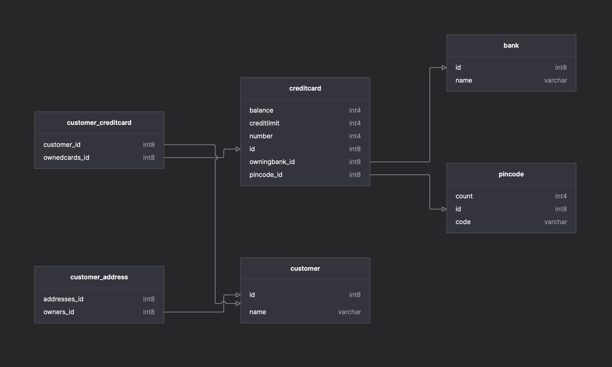

# Assignment 4

## Experiment 1

Cloning and running the main class went fine.

## Experiment 2

Here is the [code](https://github.com/sondregj/dat250-jpa-tutorial/tree/sondregj/src/main/java/no/hvl/dat250/jpa/tutorial/creditcards).

Questions:

1. The database used in this experiment is H2, an in-memory database that is created when the program starts.
2. Here are the SQL statements that create the `Customer`-table and its join tables):

   ```sql
   create table Customer (
     id bigint generated by default as identity,
     name varchar(255),
     primary key (id)
   )
   create table Customer_Address (
     addresses_id bigint not null,
     owners_id bigint not null,
     primary key (addresses_id, owners_id)
   )
   create table Customer_CreditCard (
     Customer_id bigint not null,
     ownedCards_id bigint not null,
     primary key (Customer_id, ownedCards_id)
   )
   ```

3. I used `hibernate.show_sql` in `persistence.xml` to see the SQL statements, and compiled a schema and generated a diagram from the output. (I excluded the `Todo`-table)
   
   [Schema](./schema.hibernate.sql)

As far as technical problems along the way, I had some problems due to annotations being wrong. I resolved them by opening the test report and looking at the error messages, and going through the code again to see what was wrong.
